## React Tailwind Node PostgreSQL Express CRUD
A CRUD-based web application that allows users to create, view, update, and delete records. It includes functionalities such as data entry forms, dynamic record display, 
real-time editing, and deletion with confirmation message.

### Final Result of Project

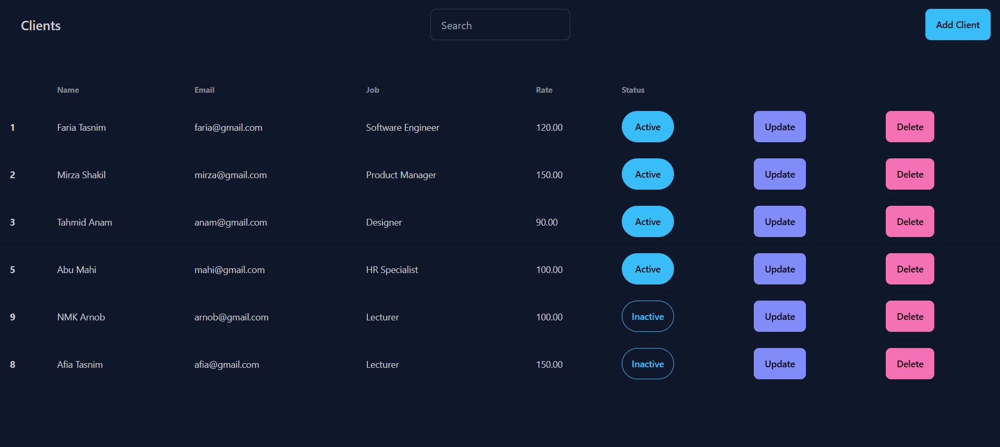

### Create

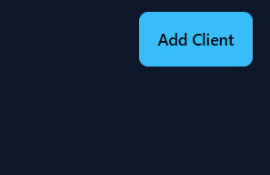

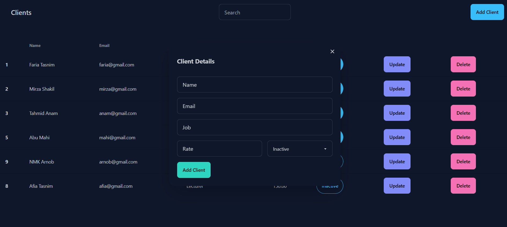

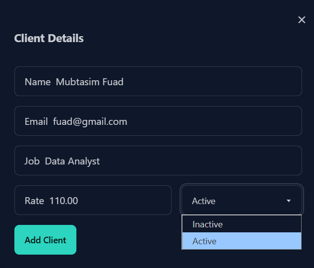

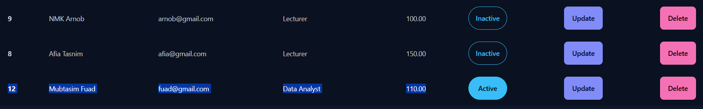

### Update

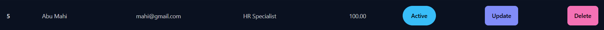

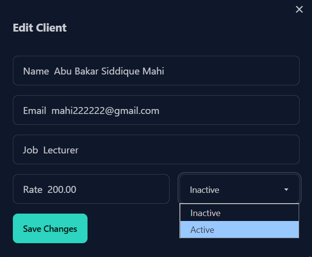

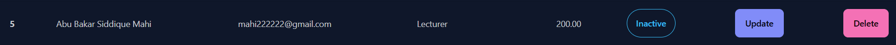

### Delete

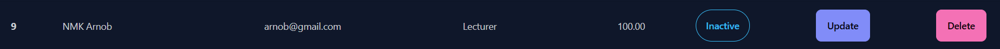

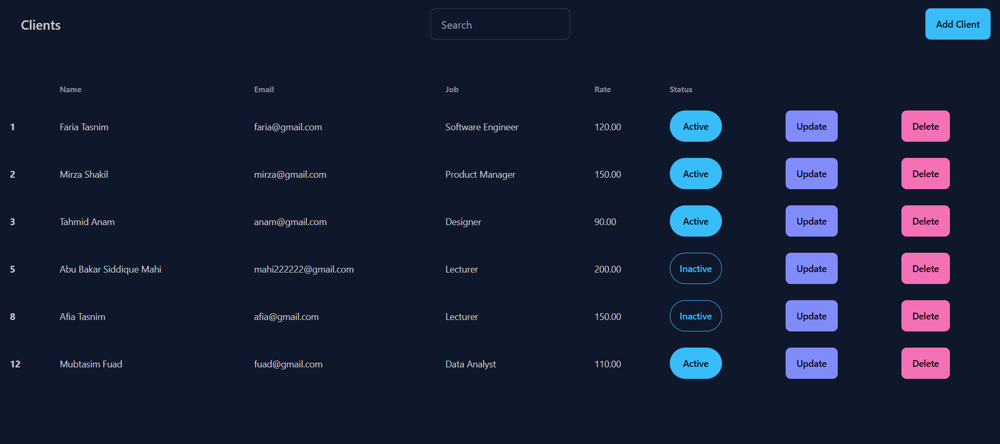

### Search

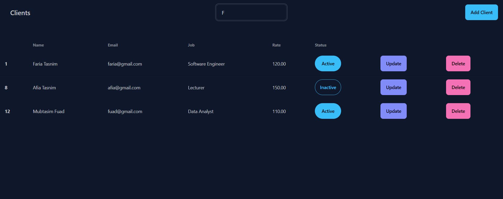

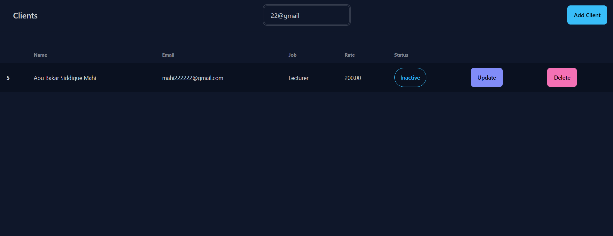

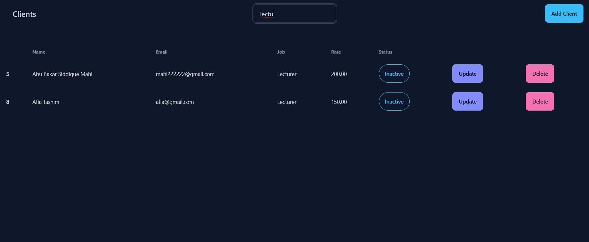

